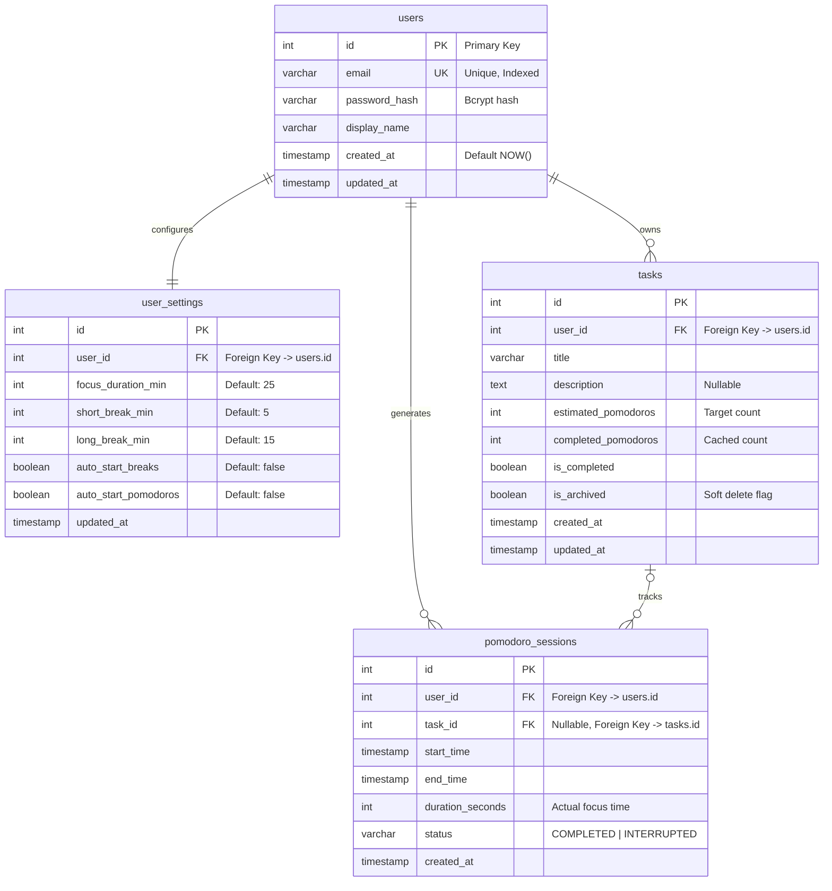
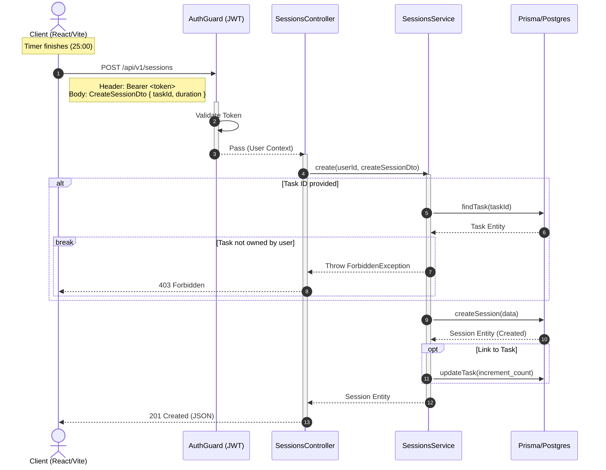
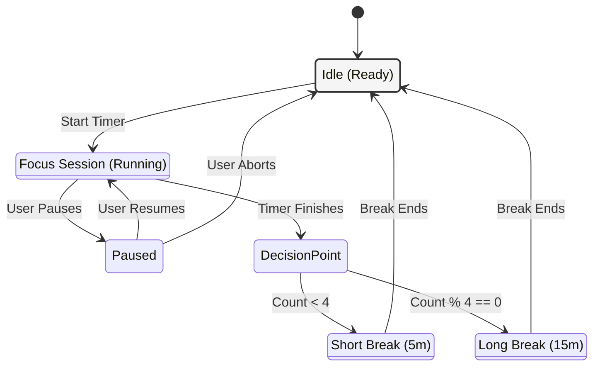

# 🍅 FocusFlow: Enterprise-Grade Pomodoro Application

> A full-stack, DevOps-enabled productivity tool designed to demonstrate modern software architecture, containerization, and clean code practices.

### 📖 Introduction
**FocusFlow** is not just another timer; it's a solution for the distracted mind, built with the rigor of an enterprise application. It combines the **Pomodoro Technique** with **Task Management** to help users achieve deep work states.

This project serves as a portfolio showcase demonstrating:
* **System Architecture**: Clean Architecture principles with a decoupled frontend and backend.
* **DevOps Mindset**: Fully containerized environment using Docker & automated CI/CD pipelines.
* **Data Integrity**: Robust database schema design with PostgreSQL and Prisma ORM.
* **Type Safety**: End-to-end type safety using TypeScript.

---

### 🛠 Tech Stack

**Backend & Database**
*  **NestJS**: For scalable server-side architecture.
*  **PostgreSQL**: Relational database for persistent data storage.
*  **Prisma**: Next-generation ORM.
*  **JWT**: Secure stateless authentication.

**Frontend**
*  **React (Vite)**: Fast and responsive UI.
*  **TypeScript**: For static typing and code reliability.
*  **Tailwind CSS / Shadcn UI**: For modern styling.

**DevOps & Infrastructure**
*  **Docker & Compose**: Containerization for consistent environments.
*  **GitHub Actions**: CI/CD for automated testing and checks.


#Structure
```text
pomodoro-monorepo/
├── .github/
│   └── workflows/
│       ├── ci-backend.yml    # 後端自動測試與檢查
│       └── ci-frontend.yml   # 前端建置檢查
├── backend/                  # NestJS 專案
│   ├── src/
│   ├── Dockerfile            # 後端映像檔設定 (Multi-stage build)
│   ├── .env.example          # 環節變數範本 (不包含敏感資料)
│   └── package.json
├── frontend/                 # React + Vite 專案
│   ├── src/
│   ├── Dockerfile            # 前端映像檔設定 (Nginx hosting)
│   └── package.json
├── docker-compose.yml        # 一鍵啟動整個開發環境
├── docker-compose.prod.yml   # 生產環境配置 (模擬)
└── README.md                 # 專案門面
```


#ERDiagram



#Sequence Diagram



#High-Level System Architecture



#State Machine

