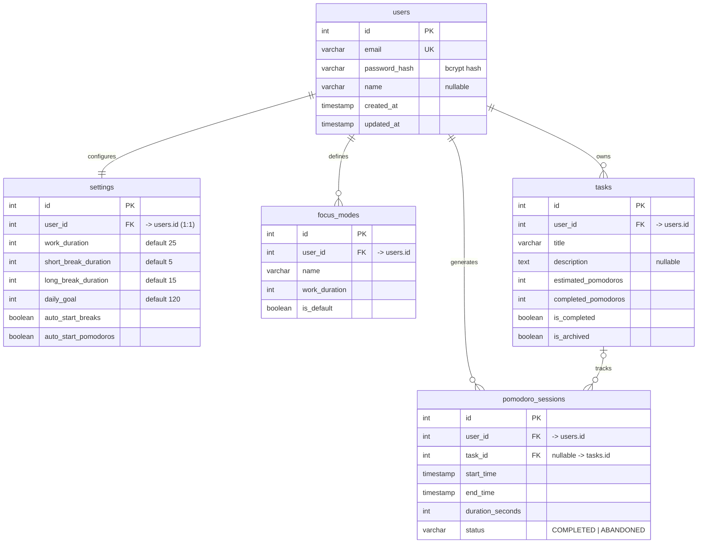
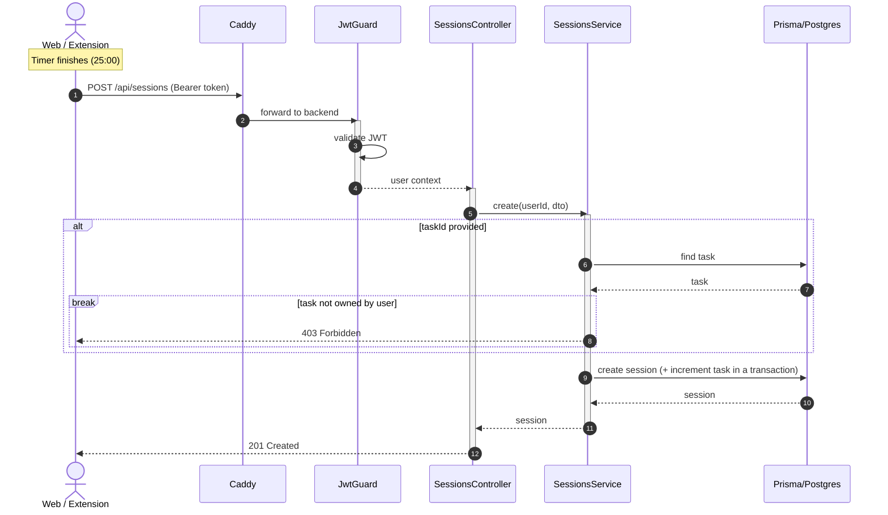
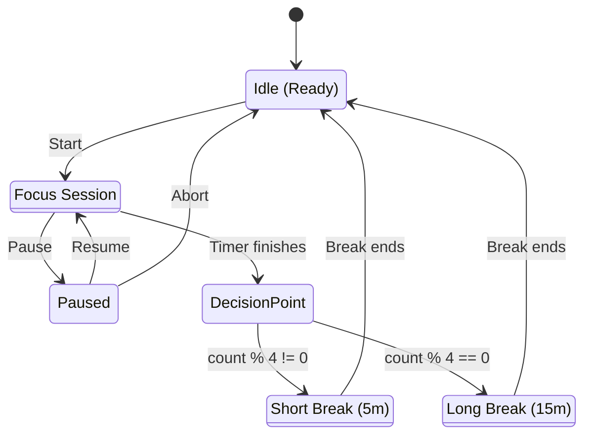

# 🍅 FocusFlow — Full-Stack Pomodoro App

> A multi-client productivity tool (web + browser extension) on a polyglot
> microservice backend, fully containerized with automatic HTTPS.

### 📖 Introduction
**FocusFlow** combines the **Pomodoro Technique** with task management and focus
analytics. It's built as a portfolio piece to demonstrate real full-stack +
DevOps practices end to end:

* **Polyglot microservices** — a TypeScript (NestJS) API for writes, plus a
  small **Go** service for read-heavy analytics.
* **Stateless auth** — JWT (HS256) verified independently by both services using
  a shared secret, so the system scales horizontally.
* **Containerized delivery** — every service is a Docker image, orchestrated by
  Docker Compose behind a single Caddy reverse proxy with automatic HTTPS.
* **Type safety** — TypeScript across web/extension/backend; typed Go service.

See [`COMPONENTS.md`](./COMPONENTS.md) for a component-by-component breakdown and
[`DEPLOY.md`](./DEPLOY.md) for the deployment runbook.

---

### 🛠 Tech Stack

**Backend**
* **NestJS** (TypeScript) — auth, tasks, sessions, settings, focus modes. **Owns the schema and all writes.**
* **Go** (`stats-service`) — read-only analytics (summary, weekly, heatmap); chi + pgx + golang-jwt.
* **PostgreSQL** — relational data store (accessed via Prisma from NestJS; via pgx read-only from Go).
* **JWT** — stateless authentication shared across both services.

**Frontend**
* **Next.js** (App Router) + **React** + **TypeScript**.
* **Tailwind CSS** for styling; **recharts** + a calendar heatmap for analytics.
* (Planned) **Chrome extension** sharing the same backend — see `CAPSTONE_PLAN.md` Phase 6.

**DevOps & Infrastructure**
* **Docker & Docker Compose** — multi-stage builds; Go image ~20 MB.
* **Caddy** — single entrypoint, path-based reverse proxy, **automatic HTTPS** (Let's Encrypt).
* **GitHub Actions** — CI: lint/test/build for TypeScript + `go vet`/`go test` for Go.

---

### 📁 Project Structure
```text
pomodoro-app/
├── .github/workflows/ci.yml      # CI: backend + frontend + Go stats service
├── frontend/                     # Next.js app (web client)
│   ├── app/                      # routes, components
│   ├── utils/api.ts              # axios clients: /api (NestJS) + /stats-api (Go)
│   └── Dockerfile                # Next.js standalone build
├── backend/                      # NestJS API (writes + schema owner)
│   ├── src/                      # auth, tasks, sessions, settings, focus-modes
│   ├── prisma/                   # schema + migrations
│   ├── .env.example
│   └── Dockerfile                # multi-stage; runs `prisma migrate deploy` on start
├── stats-service/                # Go analytics microservice (read-only)
│   ├── cmd/server, internal/…    # auth (JWT) / config / stats (repo→service→handler)
│   └── Dockerfile                # multi-stage → distroless (~20 MB)
├── caddy/Caddyfile               # reverse proxy + automatic HTTPS
├── docker-compose.prod.yml       # db + backend + stats-service + frontend + caddy
├── docker-compose.yml            # local DB only (Postgres + pgAdmin) for dev
├── .env.prod.example
├── COMPONENTS.md                 # component reference
├── DEPLOY.md                     # DigitalOcean deployment runbook
└── CAPSTONE_PLAN.md              # roadmap / progress tracker
```

---

### 🚀 Run it

**Full stack locally (Docker):**
```bash
cp .env.prod.example .env.prod        # set DOMAIN=:80 for plain-HTTP local test
docker compose -f docker-compose.prod.yml --env-file .env.prod up -d --build
# open http://localhost
```

**Deploy to a server:** follow [`DEPLOY.md`](./DEPLOY.md) (DigitalOcean Droplet,
real domain, automatic HTTPS).

---

### 🏗 High-Level System Architecture
```mermaid
graph TD
    classDef client fill:#e3f2fd,stroke:#1565c0,stroke-width:2px;
    classDef proxy fill:#f3e5f5,stroke:#7b1fa2,stroke-width:2px;
    classDef app fill:#e8f5e9,stroke:#2e7d32,stroke-width:2px;
    classDef data fill:#fff3e0,stroke:#ef6c00,stroke-width:2px;

    Browser[Web (Next.js) + Chrome Extension]:::client

    subgraph Host ["DigitalOcean Droplet"]
        subgraph DockerNetwork ["Docker network"]
            direction TB
            Caddy[Caddy Reverse Proxy<br/>80/443 · auto HTTPS]:::proxy
            Frontend[Frontend<br/>Next.js · 3000]:::app
            Backend[Backend<br/>NestJS · 3000<br/>writes + schema]:::app
            Stats[Stats Service<br/>Go · 4000<br/>read-only]:::app
            DB[(PostgreSQL · 5432)]:::data
        end
        Volume[Docker Volume<br/>pg_data]:::data
    end

    Browser -- HTTPS --> Caddy
    Caddy -- "/" --> Frontend
    Caddy -- "/api/*" --> Backend
    Caddy -- "/stats-api/*" --> Stats
    Backend -- "Prisma (read/write)" --> DB
    Stats -- "pgx (read-only)" --> DB
    DB -.-> Volume
```
> **Single-writer rule:** NestJS owns the schema and is the only writer; the Go
> service only reads. Both verify the same JWT (HS256) independently.

---

### 🗄 Entity Relationship Diagram

```mermaid
erDiagram
    users {
        int id PK
        varchar email UK
        varchar password_hash "bcrypt hash"
        varchar name "nullable"
        timestamp created_at
        timestamp updated_at
    }
    settings {
        int id PK
        int user_id FK "-> users.id (1:1)"
        int work_duration "default 25"
        int short_break_duration "default 5"
        int long_break_duration "default 15"
        int daily_goal "default 120"
        boolean auto_start_breaks
        boolean auto_start_pomodoros
    }
    focus_modes {
        int id PK
        int user_id FK "-> users.id"
        varchar name
        int work_duration
        boolean is_default
    }
    tasks {
        int id PK
        int user_id FK "-> users.id"
        varchar title
        text description "nullable"
        int estimated_pomodoros
        int completed_pomodoros
        boolean is_completed
        boolean is_archived
    }
    pomodoro_sessions {
        int id PK
        int user_id FK "-> users.id"
        int task_id FK "nullable -> tasks.id"
        timestamp start_time
        timestamp end_time
        int duration_seconds
        varchar status "COMPLETED | ABANDONED"
    }

    users ||--|| settings : "configures"
    users ||--o{ focus_modes : "defines"
    users ||--o{ tasks : "owns"
    users ||--o{ pomodoro_sessions : "generates"
    tasks |o--o{ pomodoro_sessions : "tracks"
```

---

### 🔁 Create-Session Sequence

```mermaid
sequenceDiagram
    autonumber
    actor Client as Web / Extension
    participant Caddy
    participant Guard as JwtGuard
    participant Ctrl as SessionsController
    participant Svc as SessionsService
    participant DB as Prisma/Postgres

    Note over Client: Timer finishes (25:00)
    Client->>Caddy: POST /api/sessions (Bearer token)
    Caddy->>Guard: forward to backend
    activate Guard
    Guard->>Guard: validate JWT
    Guard-->>Ctrl: user context
    deactivate Guard
    activate Ctrl
    Ctrl->>Svc: create(userId, dto)
    activate Svc
    alt taskId provided
        Svc->>DB: find task
        DB-->>Svc: task
        break task not owned by user
            Svc-->>Client: 403 Forbidden
        end
    end
    Svc->>DB: create session (+ increment task in a transaction)
    DB-->>Svc: session
    Svc-->>Ctrl: session
    deactivate Svc
    Ctrl-->>Client: 201 Created
    deactivate Ctrl
```

---

### ⏱ Timer State Machine

```mermaid
stateDiagram-v2
    classDef work fill:#e8f5e9,stroke:#2e7d32,stroke-width:2px;
    classDef break fill:#e3f2fd,stroke:#1565c0,stroke-width:2px;

    [*] --> Idle
    state "Idle (Ready)" as Idle
    state "Focus Session" as Focus:::work
    state "Paused" as Paused
    state "Short Break (5m)" as ShortBreak:::break
    state "Long Break (15m)" as LongBreak:::break

    Idle --> Focus : Start
    Focus --> Paused : Pause
    Paused --> Focus : Resume
    Paused --> Idle : Abort
    Focus --> DecisionPoint : Timer finishes
    state DecisionPoint <<choice>>
    DecisionPoint --> ShortBreak : count % 4 != 0
    DecisionPoint --> LongBreak : count % 4 == 0
    ShortBreak --> Idle : Break ends
    LongBreak --> Idle : Break ends
```
