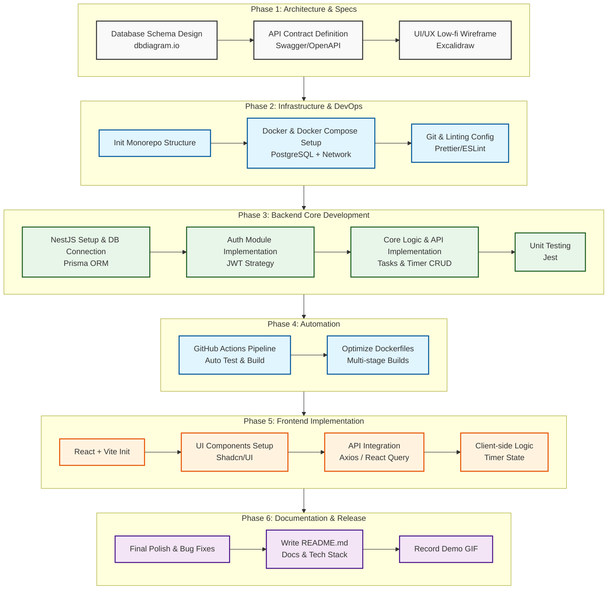

```mermaid
graph TD
    %% Styling
    classDef planning fill:#f9f9f9,stroke:#333,stroke-width:2px;
    classDef devops fill:#e1f5fe,stroke:#01579b,stroke-width:2px;
    classDef backend fill:#e8f5e9,stroke:#1b5e20,stroke-width:2px;
    classDef frontend fill:#fff3e0,stroke:#e65100,stroke-width:2px;
    classDef polish fill:#f3e5f5,stroke:#4a148c,stroke-width:2px;

    %% Phase 1: Planning
    subgraph P1 [Phase 1: Architecture & Specs]
        A1[Database Schema Design<br/>dbdiagram.io]:::planning --> A2[API Contract Definition<br/>Swagger/OpenAPI]:::planning
        A2 --> A3[UI/UX Low-fi Wireframe<br/>Excalidraw]:::planning
    end

    %% Phase 2: Infra
    subgraph P2 [Phase 2: Infrastructure & DevOps]
        B1[Init Monorepo Structure]:::devops --> B2[Docker & Docker Compose Setup<br/>PostgreSQL + Network]:::devops
        B2 --> B3[Git & Linting Config<br/>Prettier/ESLint]:::devops
    end

    %% Phase 3: Backend
    subgraph P3 [Phase 3: Backend Core Development]
        C1[NestJS Setup & DB Connection<br/>Prisma ORM]:::backend --> C2[Auth Module Implementation<br/>JWT Strategy]:::backend
        C2 --> C3[Core Logic & API Implementation<br/>Tasks & Timer CRUD]:::backend
        C3 --> C4[Unit Testing<br/>Jest]:::backend
    end

    %% Phase 4: CI/CD
    subgraph P4 [Phase 4: Automation]
        D1[GitHub Actions Pipeline<br/>Auto Test & Build]:::devops --> D2[Optimize Dockerfiles<br/>Multi-stage Builds]:::devops
    end

    %% Phase 5: Frontend
    subgraph P5 [Phase 5: Frontend Implementation]
        E1[React + Vite Init]:::frontend --> E2[UI Components Setup<br/>Shadcn/UI]:::frontend
        E2 --> E3[API Integration<br/>Axios / React Query]:::frontend
        E3 --> E4[Client-side Logic<br/>Timer State]:::frontend
    end

    %% Phase 6: Polish
    subgraph P6 [Phase 6: Documentation & Release]
        F1[Final Polish & Bug Fixes]:::polish --> F2[Write README.md<br/>Docs & Tech Stack]:::polish
        F2 --> F3[Record Demo GIF]:::polish
    end

    %% Flow connections
    P1 --> P2
    P2 --> P3
    P3 --> P4
    P4 --> P5
    P5 --> P6

```