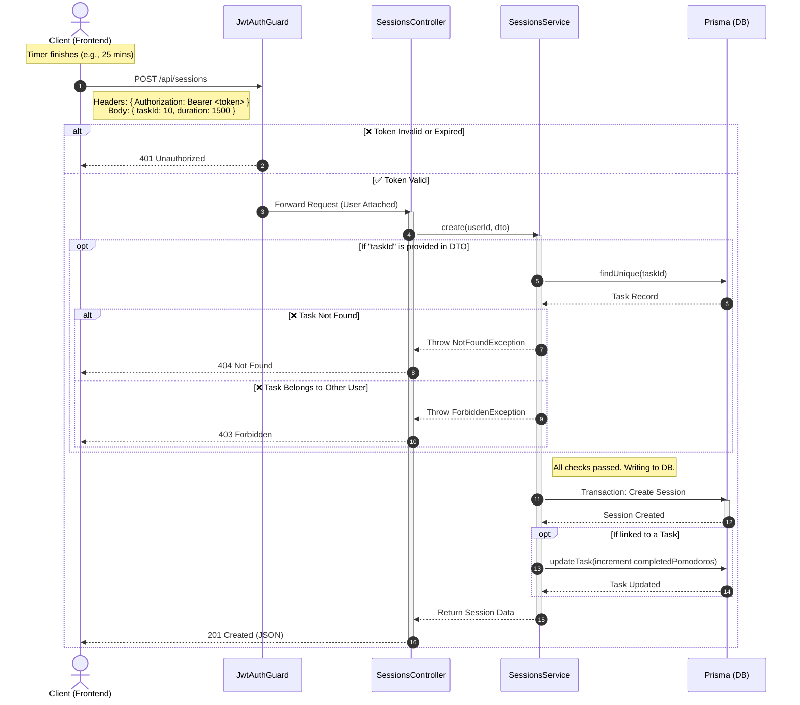

```mermaid
sequenceDiagram
    autonumber
    
    actor Client as Client (Frontend)
    participant Guard as JwtAuthGuard
    participant Ctrl as SessionsController
    participant Svc as SessionsService
    participant DB as Prisma (DB)

    Note over Client: Timer finishes (e.g., 25 mins)

    Client->>Guard: POST /api/sessions
    Note right of Client: Headers: { Authorization: Bearer <token> }<br/>Body: { taskId: 10, duration: 1500 }

    %% 1. Authentication Check
    alt ❌ Token Invalid or Expired
        Guard-->>Client: 401 Unauthorized
    else ✅ Token Valid
        Guard->>Ctrl: Forward Request (User Attached)
        activate Ctrl
        Ctrl->>Svc: create(userId, dto)
        activate Svc

        %% 2. Task Validation Logic (Only if taskId is provided)
        opt If "taskId" is provided in DTO
            Svc->>DB: findUnique(taskId)
            DB-->>Svc: Task Record
            
            alt ❌ Task Not Found
                Svc-->>Ctrl: Throw NotFoundException
                Ctrl-->>Client: 404 Not Found
            else ❌ Task Belongs to Other User
                Svc-->>Ctrl: Throw ForbiddenException
                Ctrl-->>Client: 403 Forbidden
            end
        end

        %% 3. Core Creation Logic (Happy Path)
        Note right of Svc: All checks passed. Writing to DB.

        Svc->>DB: Transaction: Create Session
        activate DB
        DB-->>Svc: Session Created
        deactivate DB

        %% 4. Side Effect: Update Task Progress
        opt If linked to a Task
            Svc->>DB: updateTask(increment completedPomodoros)
            DB-->>Svc: Task Updated
        end

        Svc-->>Ctrl: Return Session Data
        deactivate Svc

        Ctrl-->>Client: 201 Created (JSON)
        deactivate Ctrl
    end
```